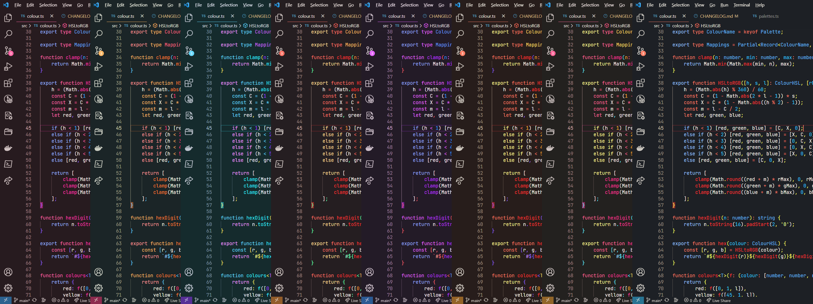

# Tarren's theme collection

A collection of personal themes for various software, inspired mainly by manga/anime.


_Themes are: 'Slime', 'Bloody', 'Rider', '"Girl"', and 'Good Job'._

## Installation

### Vim

This example usses [plugged](https://github.com/junegunn/vim-plug).

```vim

" if using vim airline
let g:airline_theme='tarren'

call plug#begin('~/.vim/plugged')

" Your other plugins

Plug 'EpokTarren/themes.vim'

call plug#end()

" Your choice of colour scheme in this example it is "Girl"
let g:theme_style = '"Girl"'
colorscheme tarren
```

### Highlight.js

If you want to import the files in your project and bundle them with the rest of your css.

```sh
# with npm
npm install "git://github.com/EpokTarren/themes.git#highlight.js"
# with yarn
yarn add "git://github.com/EpokTarren/themes.git#highlight.js"
```

If you want to just include a stylesheet, replace \[theme] with your desired variant ('slime', 'bloody', 'rider', 'girl', and 'good-job').

```html
<link rel="stylesheet" href="https://raw.githubusercontent.com/EpokTarren/themes/highlight.js/dist/[theme]-min.css" />
```

### Pygments

If you want to import the files in your project and bundle them with the rest of your css.

```sh
# with npm
npm install "git://github.com/EpokTarren/themes.git#pygments"
# with yarn
yarn add "git://github.com/EpokTarren/themes.git#pygments"
```

If you want to just include a stylesheet, replace \[theme] with your desired variant ('slime', 'bloody', 'rider', 'girl', and 'good-job').

```html
<link rel="stylesheet" href="https://raw.githubusercontent.com/EpokTarren/themes/pygments/dist/[theme]-min.css" />
```

### Spicetify

Extract the zipped folder from relases into your themes directory.

## License

Themes are licensed under [MIT](./LICENSE).
